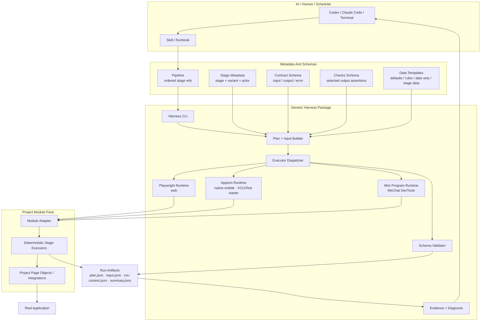
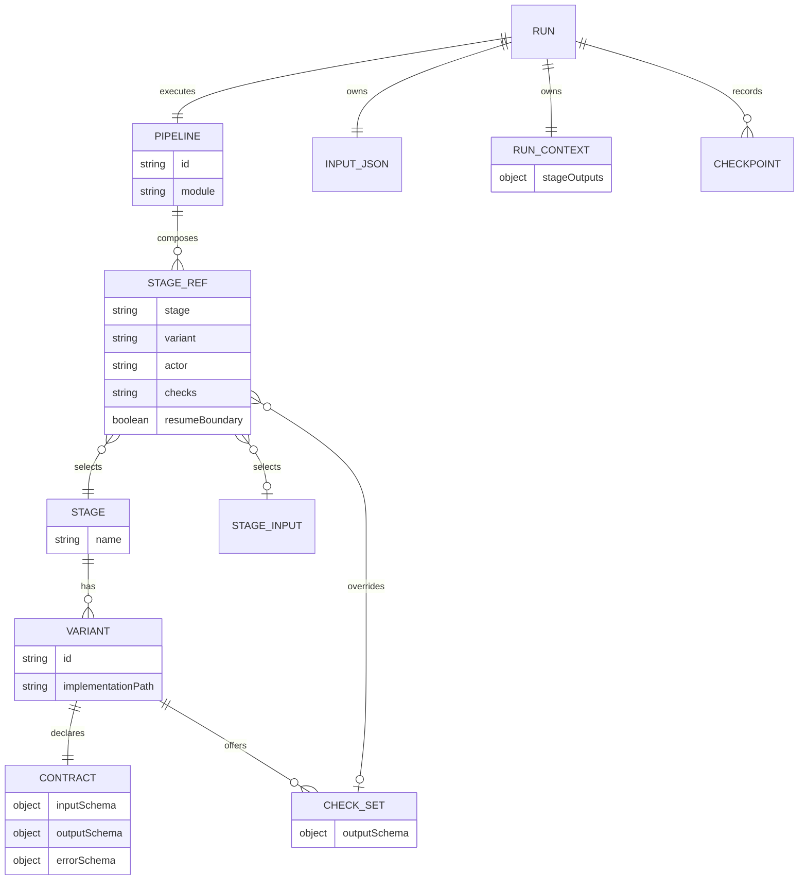

# RegressionWright Architecture

This document records the generic harness model. Keep project-specific facts in module pack docs.

## Goal

Build a deterministic real E2E regression harness where:

- scripts execute web, native-app, or Mini Program workflows;
- AI plans, observes, diagnoses, and edits code when needed;
- daily runs do not depend on AI clicking through the application;
- the same project can run from terminal, Codex, Claude Code, or a scheduler.

## Layered Model



The important boundary is not the browser. The boundary is metadata plus artifacts. AI should reason through those files during daily runs.

## Core Concepts



Definitions:

- `Pipeline` is the business workflow users ask to run.
- `Stage Ref` is a pipeline position selecting one stage variant and optional actor/checks.
- `resumeBoundary` is a stage-ref flag that marks a safe recovery start for this pipeline.
- `Stage` is a reusable workflow capability.
- `Variant` is one concrete way to run that stage.
- `Contract` is the stable boundary for stage input, output, and error.
- `Checks` are named output assertion schemas. They describe what must be true after a stage has run.
- `Run Context` is the only handoff channel between stages.

## Why Checks Are Schemas

Checks are not page automation code. Stage code performs the UI work and calculates facts such as:

```text
summaryVisible=true
lineSubtotalDisplayVerified=true
revisionDetailUrlChanged=true
```

The selected check set asserts those facts from `run-context.json`:

```text
checks/{module}/{stage}/{checks}.json
  -> outputSchema
  -> validate run-context.json after stage execution
```

This keeps the framework project-agnostic:

- the harness only validates schemas;
- the project stage owns how a fact is observed or calculated;
- AI can read checks without understanding internal browser steps;
- the same stage can expose `smoke`, `regression`, and `full-regression` check sets.

## Runtime Boundary

Normal runs enter through `pnpm regressionwright run` or `pnpm regressionwright daily`.

```text
pipeline metadata
  -> data node
  -> plan.json + input.json
  -> deterministic stages
  -> run-context.json
  -> contract/check validation
  -> evidence + summary
```

Rules:

- The data node writes `input.json` before any executor stage runs.
- Environment `dataProfile` selects stage-data `profiles` overrides before
  `input.json` is written; pipeline structure stays unchanged.
- Missing `plan.json` or `input.json` fails fast unless `E2E_REGRESSION_DEV_FALLBACK=1` is explicitly set for raw Playwright debugging.
- Every selected stage must use the same executor type. Mixed Playwright/Appium pipelines fail during planning.
- Stages share state only through `run-context.json`.
- Contracts and checks validate stage boundaries after execution.

## AI Modes

### Initialization

Used when creating or repairing coverage.

AI may inspect app code, traces, browser state, and stage internals. The output must be deterministic stage code plus metadata, contracts, checks, and data templates.

### Daily Run

Used for regression execution.

AI may read:

- pipeline and stage metadata;
- `plan.json`;
- `input.json`;
- `run-context.json`;
- `summary.json`;
- screenshots, traces, and logs.

AI must not manually drive the browser inside a running stage.

### Resume Run

Used to continue from a previous failed or incomplete run.

The harness reads the previous `plan.json`, `input.json`, and `run-context.json`, finds the failed or first pending stage, then walks backward to the nearest stage ref with `resumeBoundary: true`. It starts a new run from that boundary with restored context.

The framework does not know business recovery logic. Non-idempotent stage executors must decide from run context whether to skip, verify existing state, use a safe internal path, or stop with a structured error.

### AI-Generated Input

AI may generate `--input-params` before execution starts. After the run starts, stages still consume only final `input.json` and daily-run black-box rules apply.

## Project Pack Boundary

The framework should stay project-agnostic.

Generic package files:

```text
bin/
src/core/
src/integrations/
scripts/harness.mjs
scripts/refresh-auth.mjs
scripts/open-browser-profile.mjs
tests/harness/
skills/regressionwright/
templates/project/
templates/module-pack/
```

Project-owned files:

```text
config/harness.json
src/modules/{module}/
tests/{module}/
pipelines/{module}/
stage-registry/{module}.json
stages/{module}/
contracts/{module}/
checks/{module}/
data-templates/{module}/
artifacts/
```

Do not promote project behavior into `src/core` until a second module proves it is generic.

## Stage Contract

A stage is a workflow unit with an explicit contract:

```text
description + requires + inputSchema
  -> deterministic executor
  -> outputSchema | errorSchema
```

The harness validates stage ordering before launch:

- `input.*` requirements must exist in `input.json`;
- non-input requirements must be produced by earlier stages;
- outputs must be written to `run-context.json`.

Variants should be explicit stage metadata, not hidden runtime branching:

```text
stage: invitation
variant: manual
variant: auto-fill
```

## Pipeline Composition

A pipeline composes stage refs. It should not own assertion rules or browser behavior.

Temporary stage composition is allowed only when requirements are satisfied by earlier stages or by an explicit context-loading stage.

Pipeline stage refs may also declare `resumeBoundary: true`. This is a workload-level recovery point, not a stage-owned assertion or browser behavior.

`plan.json.pipeline.nodes` is the compact machine-readable view for AI and schedulers:

```text
data node -> stage node -> stage node -> ...
```

## Data Generation

Generated data must be durable:

```text
selected stage refs + stage metadata + project data recipes + optional input params -> input.json
```

AI may generate `--input-params`, but stage execution consumes only final `input.json`.

Keep data realistic, traceable, and schema-valid. Put reusable data rules in:

```text
data-templates/{module}/
```

## Failure Diagnosis

Failures should be classified from structured artifacts first.

Common categories:

- `env_issue`: auth, browser install, network, deployment, or external service problem.
- `planning_error`: invalid pipeline or temporary stage composition.
- `script_issue`: selector, timeout, stale test data, or contract mismatch.
- `app_bug`: valid data through the real UI exposes wrong product behavior.
- `blocker`: human input or environment change is required.

Structured stage errors should include:

```json
{
  "code": "SELECTOR_NOT_FOUND",
  "category": "script_issue",
  "message": "Visible target control was not found.",
  "evidence": {
    "runDir": "artifacts/runs/<pipeline>/<run-id>",
    "screenshot": "artifacts/playwright/.../test-failed-1.png",
    "trace": "artifacts/playwright/.../trace.zip",
    "url": "https://example.test/..."
  }
}
```

## Packaging Direction

The repo has a package-shaped MVP and a standalone project scaffold. Publish only after the package name, versioning policy, and at least one standalone consumer are confirmed.

Until then:

- keep package-shaped entrypoints and the create-project scaffold working;
- keep project-specific behavior behind module adapters;
- keep documentation concise and reusable;
- treat the first module pack as an example, not as framework design.
