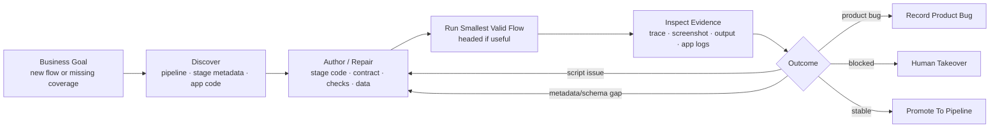
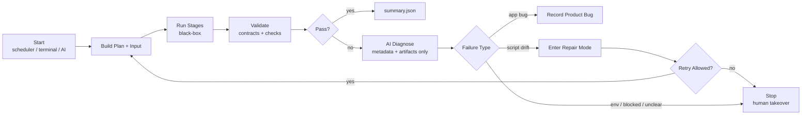
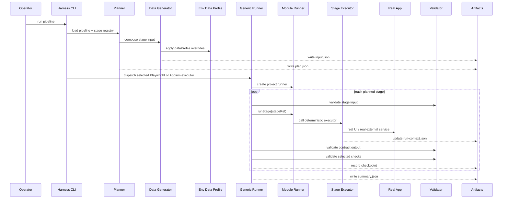
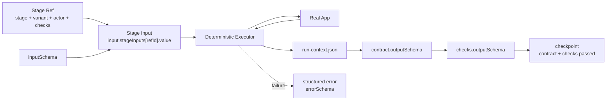
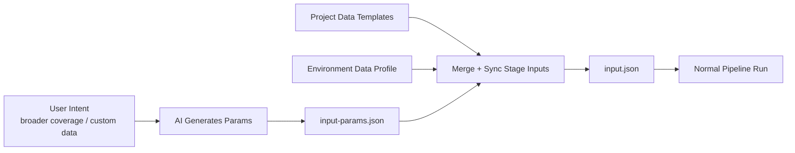
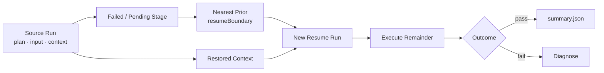

# RegressionWright Flows

This note complements the architecture document with small operational diagrams.

The diagrams intentionally stay generic. Project details belong in module pack docs.

## Initialization Flow

Initialization mode is used to create or repair deterministic coverage. AI may inspect stage internals because the purpose is to produce stable stage code and metadata.



Rules:

- AI may inspect browser state, traces, app code, and stage internals.
- The result must be deterministic executor code plus updated metadata, contract, checks, and data.
- A stage should not join daily regression until it can run without manual browser takeover.

## Daily Run Flow

Daily run mode treats stage execution as black-box. AI observes from the outside.



Rules:

- AI may read `plan.json`, `input.json`, `run-context.json`, `summary.json`, screenshots, traces, and logs.
- AI must not finish a failed stage by manually clicking inside the running browser.
- If repair is needed, switch to initialization/repair mode, update deterministic code, then rerun.

## Pipeline Execution Flow

This is what `pnpm regressionwright run <pipeline-id>` does.



Key point:

```text
Pipeline selects stage refs.
Stage refs select metadata, contract, input, and checks.
The runner executes deterministic code and validates artifacts.
```

## Stage Boundary Flow

The harness sees a stage through input, output, error, and checks.



Reference rule:

```text
Stage code calculates facts.
Contracts and checks assert those facts from run-context.
```

## AI-Generated Input Flow

AI-generated data is allowed before the pipeline starts. It becomes normal input after merge and validation.



Once execution starts, the same daily-run black-box boundary applies.

Merge order is deterministic:

```text
base stage data + profiles[env.dataProfile] + input params
```

## Resume Flow

Resume starts a new run from a prior run artifact. It does not mutate the source run.



Rules:

- `resumeBoundary` is declared on pipeline stage refs.
- If no earlier boundary exists, resume starts from the target failed or pending stage.
- Non-idempotent stages must be safe internally: reuse existing context, verify current state, skip when output already exists, or stop with a structured error.
- AI observes resume artifacts the same way as daily-run artifacts.

## Concept Reference

```text
Pipeline
  ordered Stage Refs

Stage Ref
  stage + variant + optional actor + optional checks + optional input + optional resumeBoundary

Stage
  reusable workflow capability

Variant
  concrete implementation path and metadata

Contract
  input/output/error schema

Checks
  named output assertion schema

Run
  plan.json + input.json + run-context.json + summary.json + evidence
```

Do not use `Node` as a separate core concept. In the pipeline, the position is a `Stage Ref`. The reusable business unit is a `Stage`. The vertical extension is a `Variant`.
